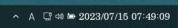
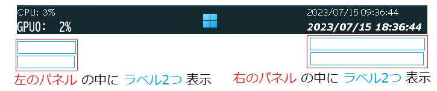
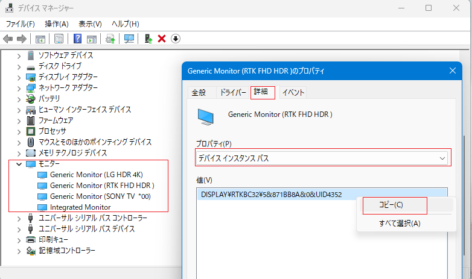
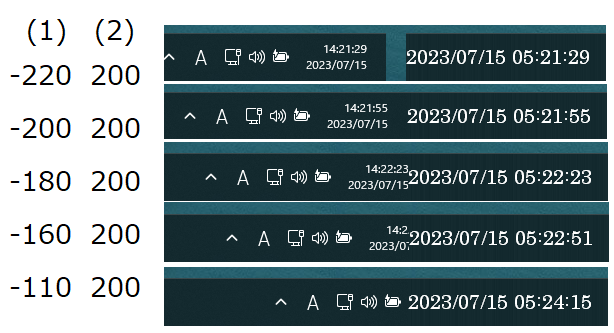

# 動作環境
Windows11 バージョン22H2 （その他の環境は手元にないので未確認）

# できること

- タスクバーに時計を表示（TClockみたいな感じ）  

- 日付と時間の表示編集設定（chronoを使用）  
https://docs.rs/chrono/latest/chrono/format/strftime/index.html
- タイムゾーン設定（chrono-tzを使用）  
https://docs.rs/chrono-tz/latest/chrono_tz/enum.Tz.html
- CPU、GPU、メモリの使用率表示
- メインディスプレイ、サブディスプレイ、指定したディスプレイで表示内容をそれぞれ設定可
- ユーザーが自由に書けるカスタムフォーマットで、chronoが対応してない書式もある程度対応可
- それぞれのタスクバーに複数のパネルを配置
- それぞれのパネルに複数のラベルを表示
- ラベルごとにタイムゾーンやフォントを設定  


# できないこと
- 設定画面がない。テキストエディタで設定を書く
- グラフ表示、ツールチップ表示、通信速度表示、インターネット時刻同期などの機能は無し
- ラベルの文字の改行（位置をずらしたラベルを2つ表示して対処してください）
- ラベルの文字の中央寄せ、右寄せ

# ダウンロードページ
https://github.com/oonsnnsk/tcc-win11/releases

# config.txt
- utf-8 (BOMなし)
- 中身はJSON型式。カンマが1つ多い少ない等でも読み込みエラーになります・・・

（例）config.txt
```
{
    "displays": [
        {
            "target": "main",
            "taskbar_adjust": {
                "left": 0,
                "right": -500
            },
            "panels": [
                {
                    "position": "right",
                    "width": 500,
                    "left": 0,
                    "show_desktop_button_position": "right",
                    "labels": [
                        {
                            "timezone": "Japan",
                            "format": "%Y/%m/%d {w_jp}曜日 %H:%M:%S",
                            "left": 0,
                            "top": 12,
                            "font_color": "FFFFFF",
                            "font_name": "游明朝",
                            "font_size": 24,
                            "font_bold": 0,
                            "font_italic": 0
                        }
                    ]
                }
            ]
        },
        {
            "target": "DISPLAY\RTKBC32\5&871BB8A&0&UID4352",
            "taskbar_adjust": {
                "left": 0,
                "right": 0
            },
            "panels": [
                {
                    "position": "left",
                    "width": 100,
                    "left": 0,
                    "show_desktop_button_position": "",
                    "labels": [
                        {
                            "timezone": "",
                            "format": "CPU:{cpu}%%",
                            "left": 0,
                            "top": 0,
                            "font_color": "FFFFFF",
                            "font_name": "Century Gothic",
                            "font_size": 20,
                            "font_bold": 0,
                            "font_italic": 0
                        },
                        {
                            "timezone": "",
                            "format": "GPU0:{gpu0}%%",
                            "left": 0,
                            "top": 24,
                            "font_color": "FFFFFF",
                            "font_name": "BIZ UDゴシック",
                            "font_size": 20,
                            "font_bold": 0,
                            "font_italic": 0
                        }
                    ]
                },
                {
                    "position": "right",
                    "width": 200,
                    "left": 0,
                    "show_desktop_button_position": "",
                    "labels": [
                        {
                            "timezone": "US/Pacific",
                            "format": "%Y/%m/%d %H:%M:%S",
                            "left": 0,
                            "top": 0,
                            "font_color": "FFFFFF",
                            "font_name": "Comic Sans MS",
                            "font_size": 20,
                            "font_bold": 0,
                            "font_italic": 0
                        },
                        {
                            "timezone": "Europe/Rome",
                            "format": "%Y/%m/%d %H:%M:%S",
                            "left": 0,
                            "top": 24,
                            "font_color": "FFFFFF",
                            "font_name": "Meiryo UI",
                            "font_size": 20,
                            "font_bold": 1,
                            "font_italic": 1
                        }
                    ]
                }
            ]
        }
    ],
    "custom_formats": [
        {
            "spec": "w_jp",
            "value": "%w",
            "replace": {
                "0": "日",
                "1": "月",
                "2": "火",
                "3": "水",
                "4": "木",
                "5": "金",
                "6": "土"
            }
        }
    ]
}
```

| 項目 | 設定値 |
| --- | --- |
| displays > target | "all", "main", "sub", "デバイスインスタンスパス" |
| displays > panels > position | "left", "center", "right" |
| displays > panels > show_desktop_button_position | "", "left", "center", "right" |
| displays > panels > labels > timezone | "", "Africa/Abidjan", "UTC", "Japan", ... [参照 Chrono-TZ](https://docs.rs/chrono-tz/latest/chrono_tz/enum.Tz.html#variants) |
| displays > panels > labels > format | [参照 Chrono](https://docs.rs/chrono/latest/chrono/format/strftime/index.html) |
| displays > panels > labels > font_color | "000000" ～ "FFFFFF" (RRGGBB形式) |
| displays > panels > labels > font_bold | 0 : 通常, 1 :太字 |
| displays > panels > labels > font_italic | 0 : 通常, 1 :斜体 |

デバイスインスタンスパスを設定する場合（ディスプレイを指定する時）は、デバイスマネージャーの該当モニターのプロパティを開いてコピペする  



タスクバーの上に最前面にしたウィンドウを重ねているだけなので、既存のタスクバーのアイコンなどが隠れますが、  
displays > taskbar_adjust でタスクバーの幅（位置）を調整できるので使いやすいように設定してください  
（例）config.txt
```JSON
{
    "displays": [
            "taskbar_adjust": {
                "left": 0,
                "right": -110   // (1) この値と
            },
            "panels": [
                    "position": "right",
                    "width": 200,   // (2) この値で以下のようになる
```
  


## config.txt カスタムフォーマット

こんな感じのをできるようにする  
  

（例）config.txt
```JSON
{
    "custom_formats": [
        {
            "spec": "w_jp",
            "value": "%w",
            "replace": {
                "0": "日",
                "1": "月",
                "2": "火",
                "3": "水",
                "4": "木",
                "5": "金",
                "6": "土"
            }
        },
        {
            "spec": "p_jp",
            "value": "%p",
            "replace": {
                "AM": "午前",
                "PM": "午後"
            }
        },
        {
            "spec": "sample1",
            "value": "%-S",
            "replace": {
                "1": "a",
                "2": "b",
                "11": "I",
                "12": "II",
                "_": "other"
            }
        }
    ]
}
```

| 項目 | 設定値 |
| --- | --- |
| custom_formats > spec | カスタムフォーマット項目名 |
| custom_formats > value | 変換元のChronoのSpec. |
| custom_formats > replace | "置換元" : "置換先"。 置換元に"_"を設定した場合は、その他の扱い

## labelのformatの書き方  {カスタムフォーマット項目名} 

- Chronoの変換は%が付くが、カスタムフォーマットは{}で囲む。書き方が違うので注意

（例）config.txt
```JSON
{
    "displays": [
            "panels": [
                    "labels": [
                            "format": "%Y年%m月%d日 {w_jp}曜日",
```


| 組み込みカスタムフォーマット項目名 | 説明 |
| --- | --- |
| cpu | CPU使用率 スペース詰め3桁 |
| _cpu | cpuと同じ |
| 0cpu | 0詰め3桁 |
| -cpu | 1～3桁 |
| mem | メモリ使用率 スペース詰め3桁 |
| _mem | memと同じ |
| 0mem | 0詰め3桁 |
| -mem | 1～3桁 |
| gpu0 | GPU0使用率 スペース詰め3桁 |
| _gpu0 | gpu0と同じ |
| 0gpu0 | 0詰め3桁 |
| -gpu0 | 1～3桁 |
| gpu1 | GPU1使用率 スペース詰め3桁 |
| _gpu1 | gpu1と同じ |
| 0gpu1 | 0詰め3桁 |
| -gpu1 | 1～3桁 |

# 雑記
rustの勉強始めたけど身が入らないので、勉強代わりにアプリ作ることにした    
TClock-Win10の更新停止に最近気づいてショックを受けたので、似たようなコピー品を作ってみた。TClockCopyのつもりでtccって名前にしたけど機能足りないし違う名前がよかったかも  
とりあえず動かすの優先で書いたらソースがぐちゃぐちゃ。でも直すの面倒なので直してない  
自動テストしてない。手動テストもあんまりしてない  
CPUやGPUの使用率はパフォーマンスモニターの値を出してるだけだけど微妙に数値が合わない  
スタートアップに入れたときの動きが変かも  
手元にWindows11がノートパソコン1台しかないので他の環境でも動くか不明。動かなかったらごめん。設定ファイルもわかりにくくてごめんね
